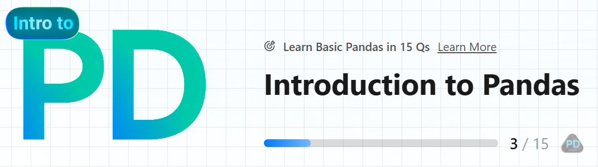

# LeetCode - Problems - Study Plan - Introduction to Pandas

This folder is part of the **LeetCode Study Plan** and focuses on solving problems using Python's **Pandas** library. The goal is to enhance proficiency in data manipulation and analysis while integrating coding exercises into the learning process.

---

## Overview

 **Pandas** is a powerful Python library for data manipulation and analysis.

---

## Folder Structure

### `Introduction_to_Pandas/`
Contains resources and solutions for learning and applying **Pandas** to solve LeetCode problems and study practical data analysis.  

- **`virtual_environment_Pandas/`**: A Python virtual environment dedicated to this study plan.
- **`requirements.txt`**: The list of Python packages required to recreate the environment for this folder.

---

