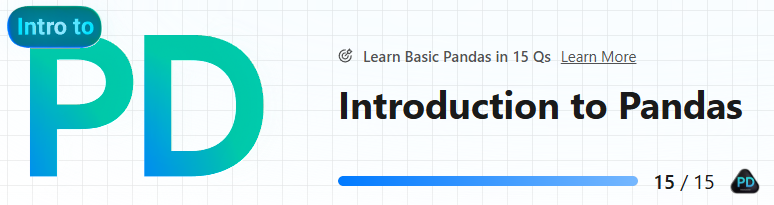

# LeetCode - Introduction to Pandas

<https://leetcode.com/studyplan/introduction-to-pandas/>

This folder is part of the **LeetCode Study Plan** and focuses on solving problems using Python’s **Pandas** library. The goal is to enhance proficiency in data manipulation and analysis while integrating coding exercises into the learning process.

---

## Overview

**Pandas** is a powerful Python library for data manipulation and analysis.

---

## Folder Structure

### `Introduction_to_Pandas/`
Contains resources and solutions for learning and applying **Pandas** to solve LeetCode problems and study practical data analysis.

- **`virtual_environment_Pandas/`**: A Python virtual environment dedicated to this study plan.
- **`requirements.txt`**: The list of Python packages required to recreate the environment for this folder.

---

## Topics Covered

### Pandas Data Structures
- [x] **Create a DataFrame from List** — [Solution] (Easy)

### Data Inspection
- [x] **Get the Size of a DataFrame** — [Solution] (Easy)
- [x] **Display the First Three Rows** — [Solution] (Easy)

### Data Selecting
- [x] **Select Data** — [Solution] (Easy)
- [x] **Create a New Column** — [Solution] (Easy)

### Data Cleaning
- [x] **Drop Duplicate Rows** — [Solution] (Easy)
- [x] **Drop Missing Data** — [Solution] (Easy)
- [x] **Modify Columns** — [Solution] (Easy)
- [x] **Rename Columns** — [Solution] (Easy)
- [x] **Change Data Type** — [Solution] (Easy)
- [x] **Fill Missing Data** — [Solution] (Easy)

### Table Reshaping
- [x] **Reshape Data: Concatenate** — [Solution] (Easy)
- [x] **Reshape Data: Pivot** — [Solution] (Easy)
- [x] **Reshape Data: Melt** — [Solution] (Easy)

### Advanced Techniques
- [x] **Method Chaining** — [Solution] (Easy)

---